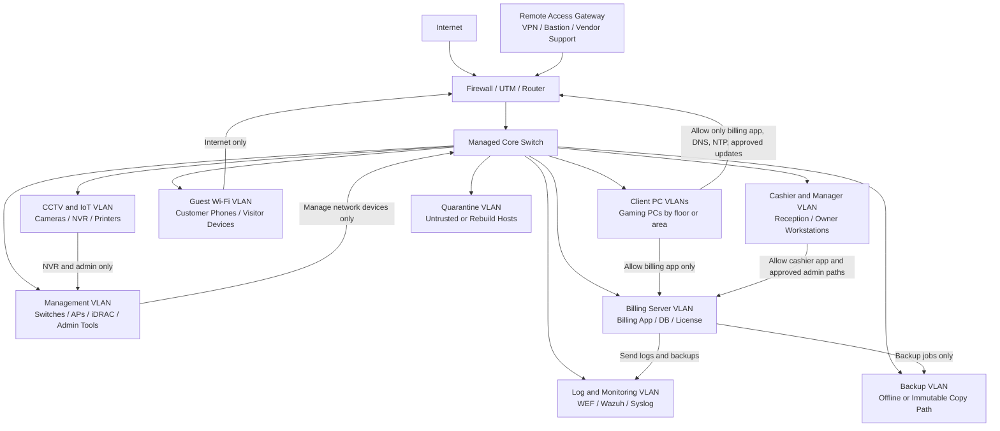

# Network Isolation Checklist

This checklist defines a network segmentation and traffic-control baseline for internet cafes, gaming venues, esports hotels, and managed shared-PC environments. It is written for a region-neutral venue model, and the controls are vendor-neutral so operators can adapt them to local law, vendors, and network constraints.

The checklist assumes the threat model in [`00-threat-model.md`](00-threat-model.md), the Windows host baseline in [`01-windows-host.md`](01-windows-host.md), and the billing software baseline in [`02-billing-software.md`](02-billing-software.md). Client PCs are treated as untrusted. Billing servers, cashier workstations, backups, logs, network devices, and remote support paths require explicit network boundaries.

Replace placeholders such as `<billing-app-port>`, `<billing-server-ip>`, `<dns-resolver-ip>`, `<ntp-server-ip>`, `<management-subnet>`, and `<vendor-update-fqdn>` with deployment-specific values.

## Threat Background

Flat venue networks allow a customer PC, guest Wi-Fi device, compromised cashier workstation, or unmanaged vendor laptop to reach services that should only be available to trusted hosts. Network isolation reduces the blast radius of endpoint compromise, limits discovery, makes misuse easier to detect, and prevents convenience paths from becoming security boundaries.

Relevant ATT&CK techniques include T1046 Network Service Discovery, T1021 Remote Services, T1105 Ingress Tool Transfer, T1557 Adversary-in-the-Middle, T1071.004 DNS, T1090 Proxy, T1133 External Remote Services, T1562 Impair Defenses, and T1486 Data Encrypted for Impact.

## Reference VLAN Architecture

The diagram below is a reference architecture, not a required product design. Small venues may implement it with a firewall, managed switch, and access points. Larger venues may split zones further by floor, host role, or tenant.



## Minimum Client-to-Billing Communication Whitelist

This table describes the intended minimum. Replace service names and ports with vendor-documented values. The key rule is that client PCs should not reach database, file-sharing, remote administration, or management interfaces on the billing server.

| Source | Destination | Protocol and Port | Direction | Purpose | Logging |
| --- | --- | --- | --- | --- | --- |
| Client PC VLAN | Billing application service on `<billing-server-ip>` | TCP `<billing-app-port>` or TCP 443 if vendor uses HTTPS | Client to server | Authenticated billing agent communication | Allow log and session correlation |
| Client PC VLAN | Billing health or telemetry endpoint, if separate | Vendor-documented TCP port | Client to server | Agent health reporting only | Allow log |
| Client PC VLAN | Internal DNS resolver | UDP/TCP 53, or approved encrypted DNS path | Client to resolver | Name resolution through controlled resolver | Query log |
| Client PC VLAN | Internal NTP source | UDP 123 | Client to time source | Time synchronization for logs and billing evidence | Allow log or NTP status |
| Client PC VLAN | DHCP relay or server | UDP 67/68 | Client to DHCP service | Address assignment | DHCP lease log |
| Client PC VLAN | Approved game, OS, EDR, and vendor update endpoints | TCP 443 through policy controls | Client to internet or update cache | Business-required updates and launchers | Proxy, firewall, or DNS log |

Explicitly deny from client PCs to the billing server:

- database ports such as TCP 1433, 3306, 5432, 1521, and vendor-specific DB listeners;
- SMB TCP 445, NetBIOS TCP 139 and UDP 137/138;
- RDP TCP/UDP 3389;
- WinRM TCP 5985/5986;
- WMI/RPC dynamic management ports;
- SSH TCP 22 unless the billing server is a documented Linux management target and source is a management subnet, not clients;
- web admin consoles, database admin consoles, backup consoles, switch management, and hypervisor management.

## Checklist

### Segmentation Design

- [ ] **NI-01: Maintain a current network diagram and zone inventory.**
  - Risk: Unknown links between client PCs, billing servers, guest Wi-Fi, cameras, and management devices can bypass hardening work.
  - Recommended configuration: Document VLAN IDs, subnets, gateways, DHCP scopes, firewall interfaces, routing paths, management IPs, and business owners for every zone.
  - Verification: Compare the diagram with switch VLAN configuration, firewall interfaces, DHCP scopes, and `arp -a` or network inventory output from approved admin hosts.
  - References: NIST CSF 2.0 ID.AM, CIS Controls v8.1 Control 12, NIST SP 800-41.

- [ ] **NI-02: Use separate VLANs or equivalent zones for client PCs, billing servers, cashier hosts, guest Wi-Fi, management, logging, backups, CCTV/IoT, and quarantine.**
  - Risk: A single broadcast domain allows easy discovery and lateral movement from physically exposed hosts.
  - Recommended configuration: Implement role-based VLANs with routed access through a firewall or Layer 3 ACL point. Do not rely only on IP address conventions.
  - Verification: Review switch VLAN membership and test from each zone that only approved destinations are reachable.
  - References: NIST SP 800-41, NIST SP 800-207, MITRE ATT&CK T1046.

- [ ] **NI-03: Route inter-VLAN traffic through a policy enforcement point.**
  - Risk: If the core switch routes freely between VLANs, firewall rules may not control lateral movement.
  - Recommended configuration: Send zone-to-zone traffic through a firewall, UTM, router ACL, or switch ACL design with centralized change control and logging.
  - Verification: Trace routes between client, cashier, server, and guest zones. Confirm enforcement device logs record allowed and denied flows.
  - References: NIST SP 800-41, CIS Controls v8.1 Control 12.

- [ ] **NI-04: Use deny-by-default rules between security zones.**
  - Risk: Allow-all internal routing makes future mistakes hard to see and turns every host into a reachable target.
  - Recommended configuration: Deny all zone-to-zone traffic by default. Add explicit allow rules for documented business flows.
  - Verification: Review firewall or ACL rule order and confirm the final rule denies and logs inter-zone traffic that is not explicitly allowed.
  - References: NIST SP 800-41, NIST SP 800-207.

- [ ] **NI-05: Keep client PCs out of the server and database networks.**
  - Risk: A compromised client should not be able to scan, authenticate to, or exploit billing databases and server management services.
  - Recommended configuration: Allow client PCs only to the documented billing application service, DNS, NTP, DHCP, and approved update paths.
  - Verification: From a client PC, test approved and denied ports with `Test-NetConnection <billing-server-ip> -Port <port>` and confirm firewall logs show expected decisions.
  - References: MITRE ATT&CK T1046 and T1021, NIST SP 800-41.

- [ ] **NI-06: Separate cashier and manager workstations from customer client PCs.**
  - Risk: Cashier hosts handle accounts, adjustments, reports, and privileged workflows that should not share a trust zone with customer-controlled systems.
  - Recommended configuration: Place cashier and manager workstations in an admin or business VLAN with narrower outbound and inbound rules than client PCs.
  - Verification: Confirm client PCs cannot initiate connections to cashier hosts. Confirm cashier hosts can reach only approved billing services, printers, DNS, NTP, update services, and remote support paths.
  - References: NIST SP 800-53 AC-4, MITRE ATT&CK T1021.

- [ ] **NI-07: Put network device management interfaces in a dedicated management VLAN.**
  - Risk: Switch, firewall, access point, CCTV, and hypervisor management pages exposed to clients or guests can lead to full network compromise.
  - Recommended configuration: Permit management access only from approved admin hosts or bastions. Disable management access from client, guest, CCTV, and cashier networks unless explicitly required.
  - Verification: From client and guest VLANs, test that HTTPS, SSH, SNMP, Telnet, and vendor management ports on network devices are unreachable.
  - References: CIS Controls v8.1 Control 12, NIST SP 800-41.

- [ ] **NI-08: Use a quarantine VLAN for rebuild, unknown, or suspicious hosts.**
  - Risk: Newly imaged, unmanaged, infected, or vendor-supplied devices can introduce risk before they are validated.
  - Recommended configuration: Provide a quarantine network with limited internet/update access and no billing, cashier, backup, or management access.
  - Verification: Move a test host to the quarantine VLAN and confirm it cannot reach internal sensitive services.
  - References: NIST CSF 2.0 RS.MA and PR.IR, MITRE ATT&CK T1105.

### Access Control Lists and Firewall Policy

- [ ] **NI-09: Build a source-destination-port matrix before opening rules.**
  - Risk: Ad hoc firewall changes accumulate into broad access that nobody can justify.
  - Recommended configuration: Record source zone, destination host or zone, protocol, port, application owner, business reason, logging level, and expiry or review date.
  - Verification: Compare the matrix with firewall rules and identify rules with `Any` source, `Any` destination, broad port ranges, or no owner.
  - References: NIST SP 800-41, CIS Controls v8.1 Control 12.

- [ ] **NI-10: Deny direct client-to-database connectivity.**
  - Risk: Database exposure to client PCs can turn endpoint compromise into billing data manipulation or credential attacks.
  - Recommended configuration: Block database ports from all client, guest, CCTV, and quarantine networks. Allow database access only from approved application servers and backup hosts.
  - Verification: Test TCP 1433, 3306, 5432, and the actual database port from a client PC and confirm failure. Review database login source addresses.
  - References: OWASP Database Security Cheat Sheet, MITRE ATT&CK T1005 and T1565.

- [ ] **NI-11: Deny SMB, RDP, WinRM, WMI, and RPC from client PCs to servers and cashier hosts.**
  - Risk: Management protocols enable lateral movement and credential exposure when reachable from untrusted clients.
  - Recommended configuration: Permit management protocols only from management VLAN, bastion, or approved admin hosts. Do not allow clients to initiate these protocols to servers or cashier workstations.
  - Verification: Test TCP 445, 3389, 5985, 5986, 135, and representative RPC dynamic ranges from client PCs. Confirm firewall deny logs.
  - References: MITRE ATT&CK T1021 Remote Services, NIST SP 800-41.

- [ ] **NI-12: Restrict cashier-to-server access to required application paths.**
  - Risk: Cashier workstations are semi-trusted and should not have unrestricted server access.
  - Recommended configuration: Permit cashier systems to reach billing application services, approved reporting services, print services if needed, DNS, NTP, and update paths. Deny database and server management access unless explicitly required.
  - Verification: Review cashier VLAN firewall rules and test denied administrative ports from a cashier workstation.
  - References: NIST SP 800-53 AC-4, OWASP ASVS architecture requirements.

- [ ] **NI-13: Restrict server-initiated connections to clients.**
  - Risk: Broad server-to-client access can become a propagation path if a server is compromised.
  - Recommended configuration: Allow only documented management, update, telemetry, or agent-response flows from server zones to client zones. Prefer client-initiated polling where supported.
  - Verification: Review firewall rules from server zones to client zones and confirm each rule has an owner, purpose, and log setting.
  - References: NIST SP 800-207, MITRE ATT&CK T1021.

- [ ] **NI-14: Log denied traffic between sensitive zones.**
  - Risk: Silent denies hide scanning, misconfiguration, and early signs of compromise.
  - Recommended configuration: Log denies from client to server, guest to internal, CCTV to internal, quarantine to internal, and internet to remote-access surfaces. Tune noisy broadcast traffic separately.
  - Verification: Generate a controlled denied connection and confirm the firewall, SIEM, or log collector records source, destination, port, action, and rule name.
  - References: NIST SP 800-92, MITRE ATT&CK T1046.

- [ ] **NI-15: Review broad `Any` rules every month.**
  - Risk: Temporary troubleshooting rules often become permanent attack paths.
  - Recommended configuration: Require an owner, justification, ticket, and expiry date for any rule using broad source, destination, service, or schedule.
  - Verification: Export firewall rules and search for `Any`, `All`, broad subnets, and service groups. Confirm each exception is documented.
  - References: NIST SP 800-41, CIS Controls v8.1 Control 12.

### Client-to-Billing Minimum Connectivity

- [ ] **NI-16: Permit only vendor-documented billing agent ports from client PCs to the billing server.**
  - Risk: Extra open ports expand the attack surface of the most important business system.
  - Recommended configuration: Allow the billing agent to connect only to the documented billing application endpoint. Prefer TLS-protected ports and server-side authentication.
  - Verification: Compare vendor documentation, process connection data, and firewall rules. Use `Get-NetTCPConnection -RemoteAddress <billing-server-ip>` on a pilot client during normal operation.
  - References: OWASP ASVS transport and architecture requirements, NIST SP 800-41.

- [ ] **NI-17: Keep DNS and NTP separate from billing authority where practical.**
  - Risk: Combining too many roles on the billing server increases blast radius and complicates recovery.
  - Recommended configuration: Use dedicated or infrastructure-managed DNS and NTP services. If the billing server must provide these services in a small venue, document the exception and harden it explicitly.
  - Verification: Run `Get-DnsClientServerAddress` and `w32tm /query /source` on client PCs. Confirm they point to approved infrastructure services.
  - References: NIST SP 800-92, Microsoft Windows Time service guidance.

- [ ] **NI-18: Block client access to billing server file shares unless a signed update workflow requires it.**
  - Risk: SMB shares on the billing server can expose installers, logs, exports, or writable paths.
  - Recommended configuration: Do not use the billing server as a general file share for client PCs. If a share is required for updates, make it read-only to clients and restricted to signed packages.
  - Verification: Run `net view \\<billing-server>` from a client PC and confirm no unauthorized shares are visible or accessible.
  - References: MITRE ATT&CK T1021.002 SMB/Windows Admin Shares, NIST SP 800-53 AC-4.

- [ ] **NI-19: Do not allow client PCs to administer the billing server.**
  - Risk: Remote administration from a customer-accessible PC breaks the trust model even if staff credentials are used.
  - Recommended configuration: Block RDP, WinRM, SSH, WMI, database admin consoles, hypervisor consoles, and web admin panels from client VLANs.
  - Verification: Test management ports from a client PC and confirm they fail. Review firewall logs for attempted access.
  - References: MITRE ATT&CK T1021, NIST SP 800-207.

- [ ] **NI-20: Document and monitor client agent connection frequency.**
  - Risk: Sudden loss of agent check-ins can indicate network failure, billing service failure, or tampering.
  - Recommended configuration: Establish normal check-in intervals and alert when a client stops communicating, communicates from the wrong subnet, or changes identity unexpectedly.
  - Verification: Review billing server logs or monitoring data for active clients, last-seen timestamps, and source IP consistency.
  - References: NIST CSF 2.0 DE.CM, MITRE ATT&CK T1562.001.

### Outbound Traffic Filtering

- [ ] **NI-21: Filter outbound internet traffic from client PCs.**
  - Risk: Unrestricted outbound access enables tool downloads, command-and-control, proxy abuse, and malware staging.
  - Recommended configuration: Permit only business-required outbound traffic, such as approved game platforms, OS updates, EDR, vendor updates, DNS to approved resolvers, and NTP to approved sources.
  - Verification: Review firewall or proxy logs by destination category and test that direct connections to non-approved ports are blocked.
  - References: MITRE ATT&CK T1105 and T1071, NIST SP 800-41.

- [ ] **NI-22: Block direct outbound DNS except to approved resolvers.**
  - Risk: Direct external DNS allows policy bypass, malware resolution, and weaker investigation records.
  - Recommended configuration: Allow UDP/TCP 53 only to approved resolvers. Redirect or block other DNS attempts. Manage approved encrypted DNS paths explicitly.
  - Verification: From a client PC, run `nslookup example.com 8.8.8.8` and confirm direct external DNS is blocked or redirected according to policy.
  - References: MITRE ATT&CK T1071.004 DNS, NIST SP 800-41.

- [ ] **NI-23: Control unmanaged DNS over HTTPS and DNS over TLS.**
  - Risk: Unmanaged encrypted DNS can bypass DNS filtering and logging.
  - Recommended configuration: Allow only approved encrypted DNS resolvers or disable unmanaged DoH/DoT where business requirements allow. Document exceptions for browsers, game launchers, and operating-system features.
  - Verification: Review firewall logs for TCP 853 and known DoH endpoints. Confirm browser and OS DNS settings follow policy.
  - References: NIST SP 800-41, MITRE ATT&CK T1071.004.

- [ ] **NI-24: Restrict outbound remote administration tools.**
  - Risk: Unapproved remote tools can bypass vendor access controls and create covert support or misuse channels.
  - Recommended configuration: Permit remote support tools only from admin or support VLANs, not from customer client PCs, unless a documented support process requires temporary access.
  - Verification: Review outbound logs for common remote support domains, ports, and processes. Confirm client VLAN rules match the approved support model.
  - References: MITRE ATT&CK T1133 External Remote Services, T1219 Remote Access Software.

- [ ] **NI-25: Block high-risk egress categories that are not required for venue operations.**
  - Risk: Proxies, anonymizers, newly registered domains, malware categories, and unauthorized file-sharing paths reduce visibility and can support abuse.
  - Recommended configuration: Use DNS filtering, secure web gateway, firewall categories, or proxy policy to block high-risk destinations while maintaining approved game and launcher functionality.
  - Verification: Review category policy and blocked-request logs. Test with approved benign test domains from the filtering vendor.
  - References: MITRE ATT&CK T1090 Proxy and T1105 Ingress Tool Transfer, CIS Controls v8.1 Control 9.

- [ ] **NI-26: Allow update traffic through controlled paths.**
  - Risk: Blocking all updates causes patch drift, while allowing all downloads creates a staging path for unwanted tools.
  - Recommended configuration: Permit OS, game, EDR, billing vendor, driver, and management updates through approved FQDNs, update caches, or controlled proxy rules.
  - Verification: Compare update logs with firewall allow logs. Confirm failed updates generate an operational alert.
  - References: NIST SP 800-40 patch management guidance, NIST SP 800-41.

- [ ] **NI-27: Monitor unusual outbound volume and destinations from billing and cashier zones.**
  - Risk: Exfiltration, ransomware staging, or vendor tool misuse may first appear as abnormal outbound traffic.
  - Recommended configuration: Baseline normal destinations and alert on new countries, unusual ports, unexpected cloud storage, large uploads, and connections outside business hours.
  - Verification: Review firewall, proxy, or NetFlow summaries for the last 30 days and document expected destinations.
  - References: MITRE ATT&CK T1041 Exfiltration Over C2 Channel, NIST CSF 2.0 DE.CM.

### DNS, DHCP, and Address Management

- [ ] **NI-28: Use controlled DNS resolvers with logging.**
  - Risk: Without DNS logs, investigations lose a low-cost view of tool downloads, suspicious domains, and policy bypass attempts.
  - Recommended configuration: Configure all venue zones to use approved resolvers that log client source, query name, response, and timestamp.
  - Verification: Generate a test DNS query and confirm it appears in resolver logs with the correct client IP and time.
  - References: NIST SP 800-92, MITRE ATT&CK T1071.004.

- [ ] **NI-29: Protect DHCP scopes and reservations for critical assets.**
  - Risk: Address conflicts or rogue DHCP can break billing, redirect traffic, or confuse investigations.
  - Recommended configuration: Use DHCP snooping where supported, static reservations for critical infrastructure, and documented DHCP scopes per VLAN.
  - Verification: Review DHCP leases, reservations, and switch DHCP snooping configuration. Confirm billing servers and network devices have fixed or reserved addresses.
  - References: CIS Controls v8.1 Control 12, MITRE ATT&CK T1557.

- [ ] **NI-30: Detect duplicate IP, duplicate hostname, and unexpected MAC address changes.**
  - Risk: Spoofed or misconfigured devices can impersonate clients, disrupt sessions, or hide unauthorized devices.
  - Recommended configuration: Monitor DHCP, ARP, switch port, and billing client inventory for identity drift.
  - Verification: Compare DHCP leases, switch MAC tables, and billing software device inventory for mismatches.
  - References: MITRE ATT&CK T1557, NIST CSF 2.0 DE.CM.

- [ ] **NI-31: Keep internal DNS names from leaking unnecessary structure.**
  - Risk: Verbose hostnames and exposed internal DNS zones help reconnaissance.
  - Recommended configuration: Avoid publishing internal zone data externally. Use naming conventions that support operations without revealing sensitive roles in guest-accessible DNS.
  - Verification: Query internal and external resolvers for venue zones and confirm only intended records are exposed.
  - References: MITRE ATT&CK T1590 Gather Victim Network Information, NIST SP 800-41.

### Wireless and Guest Network Isolation

- [ ] **NI-32: Put guest Wi-Fi in an internet-only VLAN.**
  - Risk: Customer phones and visitor laptops are unmanaged and should not reach billing, cashier, client PC, CCTV, printer, or management networks.
  - Recommended configuration: Map guest SSIDs to a guest VLAN with NAT to the internet and deny rules to all internal RFC1918 or venue-owned subnets except approved captive portal services.
  - Verification: From guest Wi-Fi, test access to billing server, cashier subnet, switch management IPs, printers, and CCTV/NVR addresses. Confirm all are blocked.
  - References: NIST SP 800-41, CIS Controls v8.1 Control 12.

- [ ] **NI-33: Enable wireless client isolation on guest SSIDs.**
  - Risk: Guests on the same SSID may attack, scan, or interfere with each other.
  - Recommended configuration: Enable AP client isolation or peer-to-peer blocking for guest networks unless a documented business feature requires local peer access.
  - Verification: Connect two test devices to guest Wi-Fi and confirm they cannot ping or connect to each other.
  - References: CIS Controls v8.1 Control 12, MITRE ATT&CK T1046.

- [ ] **NI-34: Use WPA2-Enterprise or WPA3-Enterprise for staff Wi-Fi where feasible.**
  - Risk: Shared PSKs are difficult to revoke after staff turnover or contractor access.
  - Recommended configuration: Use per-user authentication for staff Wi-Fi. If PSK is unavoidable, rotate it after staff changes and keep it separate from guest access.
  - Verification: Review WLAN security settings, RADIUS logs if present, and staff offboarding records.
  - References: NIST SP 800-153 wireless security guidance, NIST SP 800-63B-4.

- [ ] **NI-35: Keep access point management off wireless user VLANs.**
  - Risk: If AP management is reachable from guest or client networks, wireless compromise can become network compromise.
  - Recommended configuration: Place AP management interfaces in the management VLAN. Allow access only from approved admin hosts.
  - Verification: From guest and client networks, confirm AP management IPs and controller ports are unreachable.
  - References: CIS Controls v8.1 Control 12, NIST SP 800-41.

- [ ] **NI-36: Disable WPS and unused SSIDs.**
  - Risk: WPS and forgotten SSIDs create weaker access paths that staff may not monitor.
  - Recommended configuration: Disable WPS. Remove unused SSIDs and document each active SSID owner, VLAN, authentication mode, and purpose.
  - Verification: Review controller or AP configuration and scan the venue for unexpected SSIDs with approved tools.
  - References: NIST SP 800-153, CIS Controls v8.1 Control 12.

### Network Device and Management Plane Security

- [ ] **NI-37: Disable insecure management protocols on network devices.**
  - Risk: Telnet, HTTP management, SNMPv1/v2c, and weak ciphers expose credentials and configuration.
  - Recommended configuration: Use SSH, HTTPS with valid certificates where feasible, and SNMPv3. Disable unused services on switches, routers, firewalls, APs, and controllers.
  - Verification: Scan management IPs from the management VLAN and confirm only approved management services are open.
  - References: CIS Controls v8.1 Control 12, NIST SP 800-41.

- [ ] **NI-38: Use named administrator accounts for network devices.**
  - Risk: Shared network-device credentials prevent attribution and are often reused across devices.
  - Recommended configuration: Use named accounts, role-based privileges, MFA where supported, and a controlled break-glass account. Rotate credentials after staff or contractor changes.
  - Verification: Review device user lists, AAA configuration, and recent admin logs.
  - References: NIST SP 800-53 AC-2 and IA-5, CIS Controls v8.1 Control 5.

- [ ] **NI-39: Back up network device configurations securely.**
  - Risk: Misconfiguration, device failure, or destructive change can cause prolonged outage if known-good configurations are unavailable.
  - Recommended configuration: Store encrypted or access-controlled backups for firewalls, switches, APs, controllers, and routers. Version backups and restrict restore rights.
  - Verification: Compare current running configuration hash with the latest backup and perform a controlled restore test on a spare or lab device where possible.
  - References: NIST SP 800-128, NIST CSF 2.0 RC.RP.

- [ ] **NI-40: Alert on network configuration changes.**
  - Risk: Unauthorized VLAN, ACL, NAT, DNS, or remote access changes can silently weaken segmentation.
  - Recommended configuration: Send network device syslog, configuration change events, administrator login events, and firewall policy changes to central logging.
  - Verification: Make a controlled description-only change on a test device or lab rule and confirm logging captures actor, time, device, and change type.
  - References: NIST SP 800-92, CIS Controls v8.1 Control 8.

- [ ] **NI-41: Lock switch access ports to expected device types where feasible.**
  - Risk: Customers or contractors can connect unauthorized laptops, mini-routers, or bridges to open ports.
  - Recommended configuration: Disable unused ports. Use port descriptions, port security, 802.1X, MAC limits, or NAC where operationally feasible.
  - Verification: Review switch port status, MAC tables, and unused-port shutdown state. Test an unauthorized device on a spare access port in a maintenance window.
  - References: CIS Controls v8.1 Control 12, NIST SP 800-153 for wireless-adjacent access risks.

- [ ] **NI-42: Separate CCTV, printers, and IoT from billing and cashier zones.**
  - Risk: Cameras, NVRs, printers, signage, and IoT devices often run old firmware and weak management services.
  - Recommended configuration: Place CCTV and IoT devices in dedicated VLANs. Allow only required NVR, print, admin, and update flows. Deny direct access to billing databases and cashier applications.
  - Verification: From CCTV/IoT VLAN, test that billing server database and management ports are blocked. Review firmware and management exposure.
  - References: NISTIR 8259 IoT device cybersecurity capability guidance, MITRE ATT&CK T1046.

### Remote Access and External Exposure

- [ ] **NI-43: Do not expose RDP, database, SMB, or billing admin panels directly to the internet.**
  - Risk: Internet-exposed management services are common entry points for credential attacks and exploitation.
  - Recommended configuration: Use VPN, zero-trust access, or a managed remote access gateway with MFA and logging. Block direct inbound exposure to internal services.
  - Verification: Review NAT and port-forward rules. Use approved external scanning from an authorized address to confirm only intended services are exposed.
  - References: MITRE ATT&CK T1133 and T1021, NIST SP 800-207.

- [ ] **NI-44: Use a bastion or remote access gateway for administration.**
  - Risk: Allowing many workstations to administer servers and network devices increases credential exposure and weakens logging.
  - Recommended configuration: Route privileged remote administration through a hardened bastion, VPN, or access gateway with MFA, named accounts, session logging, and restricted source IPs.
  - Verification: Review remote access logs and firewall rules. Confirm admin paths originate from the gateway or management subnet only.
  - References: NIST SP 800-207, NIST SP 800-53 AC-17.

- [ ] **NI-45: Time-bound vendor access and log each support session.**
  - Risk: Always-on vendor access can persist long after the business need ends.
  - Recommended configuration: Enable vendor access only during approved support windows. Require named vendor identities, MFA where possible, ticket numbers, and post-session review.
  - Verification: Compare vendor tickets with VPN, remote support, firewall, and billing admin logs.
  - References: MITRE ATT&CK T1133, NIST SP 800-53 AC-2 and AC-17.

## Minimum Validation Package

For a network isolation review, collect the following evidence without exposing customer personal data:

- current network diagram with VLAN IDs, subnets, gateways, and zone owners;
- source-destination-port matrix for client, cashier, billing, database, management, guest, CCTV/IoT, backup, and logging zones;
- firewall or ACL export with rule owners and review dates;
- proof that client PCs cannot reach database, SMB, RDP, WinRM, WMI, or management ports on billing servers;
- proof that guest Wi-Fi cannot reach internal networks;
- DNS, DHCP, and NTP configuration from each host role;
- wireless SSID inventory with VLAN mapping and authentication mode;
- network device management access list and administrator account review;
- firewall, DNS, DHCP, VPN, and network device logs forwarding confirmation;
- latest network device configuration backup and restore-test evidence.

## Practical Test Commands

Use these commands only against systems the venue owns or is authorized to test.

```powershell
# Test whether a client can reach the billing application service.
Test-NetConnection <billing-server-ip> -Port <billing-app-port>

# Confirm database ports are blocked from client PCs.
1433,3306,5432,1521 | ForEach-Object {
    Test-NetConnection <billing-server-ip> -Port $_
}

# Inspect active client connections to the billing server.
Get-NetTCPConnection -RemoteAddress <billing-server-ip> |
    Select-Object LocalAddress,LocalPort,RemoteAddress,RemotePort,State,OwningProcess

# Review DNS resolver configuration.
Get-DnsClientServerAddress

# Review Windows time source.
w32tm /query /status
w32tm /query /source

# Check whether direct external DNS is blocked or redirected.
nslookup example.com 8.8.8.8
```

## References

- CafeSec Lab threat model foundation: `00-threat-model.md`
- CafeSec Lab Windows host hardening checklist: `01-windows-host.md`
- CafeSec Lab billing software security checklist: `02-billing-software.md`
- MITRE ATT&CK Enterprise Matrix: https://attack.mitre.org/matrices/enterprise/
- MITRE ATT&CK T1046 Network Service Discovery: https://attack.mitre.org/techniques/T1046/
- MITRE ATT&CK T1021 Remote Services: https://attack.mitre.org/techniques/T1021/
- MITRE ATT&CK T1021.002 SMB/Windows Admin Shares: https://attack.mitre.org/techniques/T1021/002/
- MITRE ATT&CK T1005 Data from Local System: https://attack.mitre.org/techniques/T1005/
- MITRE ATT&CK T1105 Ingress Tool Transfer: https://attack.mitre.org/techniques/T1105/
- MITRE ATT&CK T1557 Adversary-in-the-Middle: https://attack.mitre.org/techniques/T1557/
- MITRE ATT&CK T1071.004 DNS: https://attack.mitre.org/techniques/T1071/004/
- MITRE ATT&CK T1090 Proxy: https://attack.mitre.org/techniques/T1090/
- MITRE ATT&CK T1133 External Remote Services: https://attack.mitre.org/techniques/T1133/
- MITRE ATT&CK T1219 Remote Access Software: https://attack.mitre.org/techniques/T1219/
- MITRE ATT&CK T1041 Exfiltration Over C2 Channel: https://attack.mitre.org/techniques/T1041/
- MITRE ATT&CK T1486 Data Encrypted for Impact: https://attack.mitre.org/techniques/T1486/
- MITRE ATT&CK T1562 Impair Defenses: https://attack.mitre.org/techniques/T1562/
- MITRE ATT&CK T1565 Data Manipulation: https://attack.mitre.org/techniques/T1565/
- MITRE ATT&CK T1590 Gather Victim Network Information: https://attack.mitre.org/techniques/T1590/
- NIST SP 800-41 Rev. 1, Guidelines on Firewalls and Firewall Policy: https://csrc.nist.gov/pubs/sp/800/41/r1/final
- NIST SP 800-207, Zero Trust Architecture: https://csrc.nist.gov/pubs/sp/800/207/final
- NIST SP 800-92, Guide to Computer Security Log Management: https://csrc.nist.gov/publications/detail/sp/800-92/final
- NIST SP 800-40 Rev. 4, Guide to Enterprise Patch Management Planning: https://csrc.nist.gov/pubs/sp/800/40/r4/final
- NIST SP 800-53 Rev. 5, Security and Privacy Controls: https://csrc.nist.gov/Pubs/sp/800/53/r5/upd1/Final
- NIST SP 800-63B-4, Digital Identity Guidelines: Authentication and Authenticator Management: https://csrc.nist.gov/pubs/sp/800/63/B/4/final
- NIST SP 800-128, Guide for Security-Focused Configuration Management: https://csrc.nist.gov/publications/detail/sp/800-128/final
- NIST SP 800-153, Guidelines for Securing Wireless Local Area Networks: https://csrc.nist.gov/pubs/sp/800/153/final
- NISTIR 8259, Foundational Cybersecurity Activities for IoT Device Manufacturers: https://csrc.nist.gov/pubs/ir/8259/final
- NIST Cybersecurity Framework 2.0: https://www.nist.gov/cyberframework
- CIS Critical Security Controls v8.1: https://www.cisecurity.org/controls/v8-1
- OWASP Application Security Verification Standard: https://owasp.org/www-project-application-security-verification-standard/
- OWASP Database Security Cheat Sheet: https://cheatsheetseries.owasp.org/cheatsheets/Database_Security_Cheat_Sheet.html
- Microsoft Windows Time service: https://learn.microsoft.com/windows-server/networking/windows-time-service/windows-time-service-top
- CISA Secure by Design: https://www.cisa.gov/securebydesign
