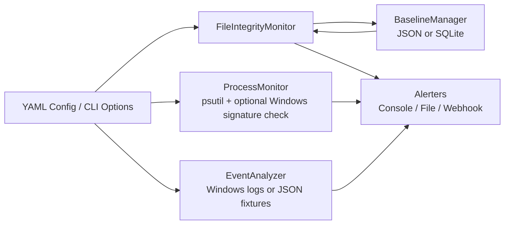

# Architecture

CafeSec Integrity Monitor is split into four layers:

1. Baseline management stores versioned file records in JSON or SQLite and optionally signs them with HMAC-SHA256.
2. File integrity scanning expands configured file, directory, and glob targets, calculates SHA-256 or BLAKE3 hashes, and compares current state with the latest baseline.
3. Runtime analysis checks process and event telemetry for venue-relevant anomalies.
4. Alerting sends deduplicated findings to console, JSON Lines files, Slack, Discord, or generic webhooks.

## Data Flow

## Trust Model

The baseline is useful only if the storage path and HMAC key are protected. In production, store baselines and alert outputs where customer users and cashier users cannot edit them. Send copies to a central log collector when possible.

## Platform Model

Core file scanning, baseline storage, alerting, and tests are cross-platform. Windows-specific checks are optional and degrade safely on Linux CI.
